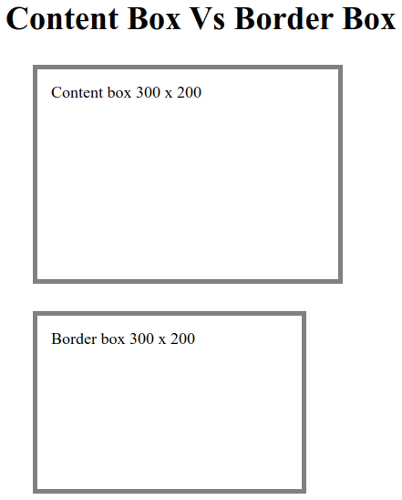
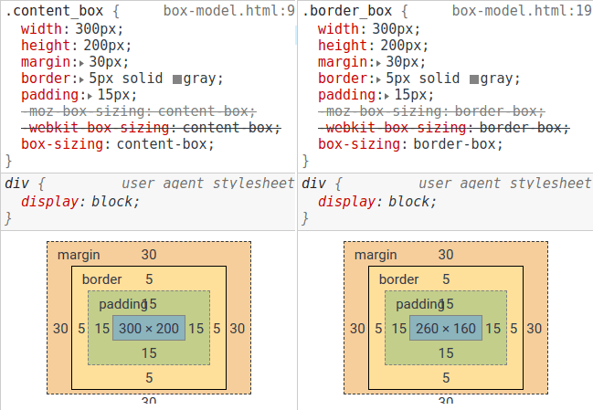

# Bootstrap
## 1. Introducción
* El código de los ejemplos de este módulo se encuentran en GitHub, en la carpeta `ejemplos/modulo01`
### 1.1 ¿Qué es Bootstrap?
* Representa uno de los frameworks front-end más populares empleados para construir sitios responsivos, con una gran variedad de elementos gráficos y plantillas entre otros.
* El siguiente código muestra la plantilla básica para iniciar a trabajar con Bootstrap.  
* Algunos componentes hacen uso de [JQuery](https://jquery.com/), [Popper.js](https://popper.js.org/) así como algunos plugins JS. Estos scripts deben incluirse en la plantilla.
```html
<!doctype html>
<html lang="en">
  <head>
    <!-- Required meta tags -->
    <meta charset="utf-8">
    <meta name="viewport" content="width=device-width, initial-scale=1, shrink-to-fit=no">

    <!-- Bootstrap CSS -->
	<link rel="stylesheet" 
	  href="https://stackpath.bootstrapcdn.com/bootstrap/4.5.2/css/bootstrap.min.css" 
	  integrity="sha384-JcKb8q3iqJ61gNV9KGb8thSsNjpSL0n8PARn9HuZOnIxN0hoP+VmmDGMN5t9UJ0Z" 
	  crossorigin="anonymous">
	  
    <title>Hello, world!</title>
  </head>
  <body>
    <h1>Hello, world!</h1>

    <!-- JavaScript -->
    <!-- jQuery first, then Popper.js, then Bootstrap JS -->
	<script src="https://code.jquery.com/jquery-3.5.1.slim.min.js" integrity="sha384-DfXdz2htPH0lsSSs5nCTpuj/zy4C+OGpamoFVy38MVBnE+IbbVYUew+OrCXaRkfj" crossorigin="anonymous"></script>
    <script src="https://cdn.jsdelivr.net/npm/popper.js@1.16.1/dist/umd/popper.min.js" integrity="sha384-9/reFTGAW83EW2RDu2S0VKaIzap3H66lZH81PoYlFhbGU+6BZp6G7niu735Sk7lN" crossorigin="anonymous"></script>
    <script src="https://stackpath.bootstrapcdn.com/bootstrap/4.5.2/js/bootstrap.min.js" integrity="sha384-B4gt1jrGC7Jh4AgTPSdUtOBvfO8shuf57BaghqFfPlYxofvL8/KUEfYiJOMMV+rV" crossorigin="anonymous"></script>
  </body>
</html>
```
* El  código completo puede consultarse [aquí.](../ejemplos/modulo01/starter-template.html)
* El resultado del ejemplo se puede visualizar [aquí.](https://jorgerdc.github.io/tutoriales/bootstrap/ejemplos/modulo01/starter-template.html)
* Bootstrap puede incorporarse haciendo uso de  BootstrapCDN  (Content Delivery Network).  Esta técnica se empleó en el ejemplo anterior.
*  Se trata de un URL público en donde se  encuentra la Bootstrap compilado y reducido listo para emplearse en los proyectos.   
* Se hace uso de un caché para mejorar el desempeño. Esto se logra incorporando Bootstrap de la siguiente manera:
##### Ejemplo:
```html
<link rel="stylesheet"
  href="https://stackpath.bootstrapcdn.com/bootstrap/4.2.1/css/bootstrap.min.css" 
  integrity="sha384-GJzZqFGwb1QTTN6wy59ffF1BuGJpLSa9DkKMp0DgiMDm4iYMj70gZWKYbI706tWS" 
  crossorigin="anonymous">
```
### 1.2 Uso de elementos globales.
* Bootstrap hace uso de  configuraciones y estilos globales cuyo principal objetivo es ***normalizar***  los estilos entre navegadores.  
La normalización de los estilos es un requerimiento fundamental en la mayoría de las aplicaciones. De aquí surge la importancia de conocerlos y tenerlos presentes en todo momento:
*  Bootstrap requiere del uso de html 5  y del tag `<!doctype html>`
```html
<html lang="en">
<!-- código de la página -->
</html>
```
* Responsive meta-tag.   Bootstrap fue desarrollado al estilo *mobile first* . Esto significa que su uso está optimizado para apps móviles y puede ser adaptado para escalar a aplicaciones web haciendo uso del concepto de  ***CSS media queries***.   El atributo `viewport` permite implementar este comportamiento por lo que no debe omitirse:
```html
<meta name="viewport" content="width=device-width, initial-scale=1, shrink-to-fit=no">
```
* Uso de [Reboot](https://getbootstrap.com/docs/4.0/content/reboot/) para proporcionar un *render* homogéneo entre navegadores y dispositivos móviles.

####  1.2.1  Uso de border-box en lugar de content-box
* Para obtener un mejor dimensionamiento  de los elementos empleando CSS,  se actualiza el valor de  la propiedad `box-sizing`. En lugar del uso de  `content-box` se emplea `border-box`.
```css
.selector-for-some-widget {
  box-sizing: content-box;
}
```
*  `border-box`  es más intuitivo ya que `context-box`.
* El  tamaño de un elemento con `context-box` es la suma de sus dimensiones + padding + border. 
* A la suma anterior se le agrega el valor del margen para calcular el espacio total que ocupará un elemento.
* Lo anterior implica que el diseñador tiene que considerar estas propiedades para calcular  el tamaño total y el espacio que ocupará un elemento.
* El tamaño  total de un elemento con `border-box`incluye  los valores de las propiedades padding y border.  El navegador ajusta el tamaño del objeto para evitar sumar los valores de estas 2 propiedades. Por lo tanto, resulta más simple para diseñar.
##### Ejemplo:
* El siguiente código muestra  un elemento de 300 * 200 empleando ambos modelos `content-box` y `border-box`.
```css
.content_box {
  width: 300px;
  height: 200px;
  margin: 30px;
  border: 5px solid gray;
  padding: 15px;
  -moz-box-sizing: content-box;
  -webkit-box-sizing: content-box;
  box-sizing: content-box;
}
.border_box {
  width: 300px;
  height: 200px;
  margin: 30px;
  border: 5px solid gray;
  padding: 15px;
  -moz-box-sizing: border-box;
  -webkit-box-sizing: border-box;
  box-sizing: border-box;
} 
```
* Ambos estilos tienen las mismas características excepto el valor de la propiedad `box-sizing`.
* Estos estilos se aplican al siguiente código:
```html
<div class="content_box">Content box 300 x 200</div>
<div class="border_box">Border box 300 x 200</div>
```
* Estos estilos obtienen el siguiente resultado:



* Observar que el primer objeto requiere más espacio  a diferencia del segundo en el que se respeta el tamaño total de 300 * 200.
* El  código completo puede consultarse [aquí.](../ejemplos/modulo01/box-model.html)
* El resultado del ejemplo se puede visualizar [aquí.](https://jorgerdc.github.io/tutoriales/bootstrap/ejemplos/modulo01/box-model.html)
* Al analizar las dimensiones de los objetos generados en el navegador se obtiene lo siguiente:



* Observar en el segundo caso, el navegador ajusta el tamaño del objeto para que la suma  border + padding + tamaño del elemento generen un total de 300 y 200, es decir, el navegador ajustó el tamaño del objeto a 260.   
	* TotalAncho = 260 + 2 * (15 + 5) = 300 
	* TotalAlto =  160 + 2 * (15  + 5) = 200
* La medida del margen no se considera ya que no forma parte del tamaño del objeto, más bien,  forma parte del espacio total que ocupará el objeto.
### 1.3 Obtener e Instalar Bootstrap
Bootstrap se puede descargar (archivo zip)  en 2 formatos:
*  Forma *compilada*.  ¡En bootstrap los archivos CSS se compilan empleando  *Sass compiler* !
	*  Sass (Syntactically Awesome Stylesheets) es un lenguaje de script (metalenguaje) empleado para construir  hojas de estilos (CSS).
*  Forma  *reducida*   (archivos css ya construidos, compilados así como archivos JavaScript reducidos).
	* La siguiente imagen muestra la estructura del archivo zip
```plaintext
bootstrap/
├── css/
│   ├── bootstrap-grid.css
│   ├── bootstrap-grid.css.map
│   ├── bootstrap-grid.min.css
│   ├── bootstrap-grid.min.css.map
│   ├── bootstrap-reboot.css
│   ├── bootstrap-reboot.css.map
│   ├── bootstrap-reboot.min.css
│   ├── bootstrap-reboot.min.css.map
│   ├── bootstrap.css
│   ├── bootstrap.css.map
│   ├── bootstrap.min.css
│   └── bootstrap.min.css.map
└── js/
    ├── bootstrap.bundle.js
    ├── bootstrap.bundle.js.map
    ├── bootstrap.bundle.min.js
    ├── bootstrap.bundle.min.js.map
    ├── bootstrap.js
    ├── bootstrap.js.map
    ├── bootstrap.min.js
    └── bootstrap.min.js.map
```
*  Bootstrap se puede instalar empleando package managers como  `npm`, `yarn` , etc.
* Notar el uso de rutas relativas. Se asume que en la carpeta donde se encuentra la plantilla, se encuentra la carpeta `bootstrap` descargada.
* `bootstrap.bundle.min.js`  incluye [Popper](https://popper.js.org/),  pero no  [jQuery](https://jquery.com/). Esta última librería se tiene que descargar e incorporar manualmente.   
* Una vez que se tenga la instalación, la plantilla se configura de la siguiente manera:
```html
<!doctype html>
<html lang="en">
  <head>
    <!-- Tags requeridos -->
    <meta charset="utf-8">
    <meta name="viewport" content="width=device-width, initial-scale=1, shrink-to-fit=no">
    <!-- Bootstrap CSS -->
    <link rel="stylesheet" href="bootstrap/css/bootstrap.min.css">
    <title>CreSer - Registrar usuario</title>
  </head>
  <body>
    <h1>Hola Mundo</h1>
    <!--JavaScript -->
    <!-- jQuery primero, despues Popper.js, y al final Bootstrap JS -->
    <!-- Ojo:  Popper  y JQuery se descargan por separado -->
    <script src="bootstrap/js/jquery-3.3.1.slim.min.js"></script>
    <!-- popper 1.14.6 -->
    <script src="bootstrap/js/popper.min.js"></script>
    <script src="bootstrap/js/bootstrap.min.js"></script>
  </body>
</html>
```
### 1.4  Bootstrap theming
* A partir de Bootstrap 4 se hace uso de *Variables Saas* , *Saas Maps*, y CSS personalizado para construir la apariencia de un sitio web. 
#### 1.4.1 Variables Saas
* Las variables  Saas definen valores por default.  Estos valores pueden ser sobrescritos empleando scripts saas  (archivos con extensión saas: `custom.scss`). El archivo personalizado realizará `@import` de los archivos saas de Bootstrap para extender o sobrescribir  su valor.  En capítulos posteriores se hablará de este tema a detalle.
```scss
$body-bg: #000;
```
#### 1.4.2 Saas Maps
* Bootstrap hace uso de Maps y Loops para representar a un conjunto de reglas CSS relacionadas.
```scss
$theme-colors: (
  "primary": #0074d9,
  "danger": #ff4136
);
```
* Este tipo de definiciones se pueden sobrescribir empleando un archivo `saas`personalizado. De forma similar, se hablará de este tema en módulos posteriores.
#### 1.4.3 Functions.
* Las funciones representan otro elemento  para personalizar la apariencia de un sitio. 
```scss
@function color($key: "blue") {
  @return map-get($colors, $key);
}
```
#### 1.4.4 Variables personalizadas
* Empleadas para personalizar estilos CSS globales, por ejemplo, variables `$enable-*`
#### 1.4.5 @each
* Algunos componentes en Bootstrap y utilerías hacen uso de `@each` para iterar sobre Map Saas. Estas iteraciones permiten aplicar variantes a un componente al modificar los valores de las variables en cada iteración.
##### Fin de módulo.
