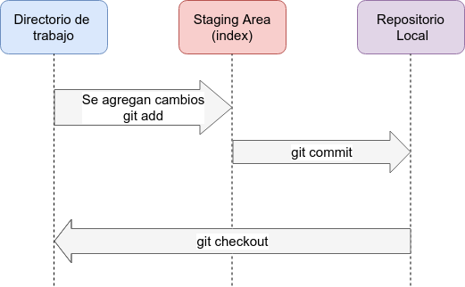


# Git 
## 1. Pasos iniciales con Git
### 1.1 Introducción
* Git es un sistema de control de versiones empleado para realizar la administración de archivos así como su coordinación entre un grupo de usuarios. Su principal uso es en desarrollo de software.
* Git se caracteriza entre otras cosas por ser un sistema de control de versiones distribuido. 
* Las carpetas de los repositorios almacenadas en cada máquina de los participantes contiene *copias completas* del  código.  Esto permite a Git trabajar sin la necesidad de estar conectado a Internet, por ejemplo, crear branches, hacer commits, etc.
* Uno de los conceptos fundamentales en Git para realizar la administración  de los archivos es el concepto de ***branch***.
* El código se guarda en ***repositorios***.  Cada repositorio cuenta con un branch principal llamado ***master***.
* Los beneficios de usar estos conceptos son:
	* Facilita el control y evolución de las versiones de los archivos de un repositorio.
	* Facilidad para realizar el control y administración de bugs o fallas.
	* Facilita y mejora el control de revisiones y cambios al código.
	* Permite realizar sincronizaciones y operaciones `merge` de forma simultánea entre los integrantes del equipo. 
* En general Git permite implementar requerimientos como "speed", "easy branching and merging",  "data integrity", "larger collaborations".
* La mayoría de los sistemas de control de versiones definen una arquitectura de 2 capas: 
	* Uso de un repositorio
	* Uso de una copia de trabajo.
* Git  incorpora una tercera capa:
	* Repositorio local / Repositorio en la nube.
	* Directorio o copia de trabajo
	* Staging area



#### 1.1.1 Working directory
* El proceso inicia cuando se inicializa un proyecto Git con el comando `git init` o cuando se realiza una *clonación*  de un proyecto existente con el comando `git clone` . Es este momento se crea una copia local de trabajo (working directory) en la que se puede realizar cualquier operación: agregar, modificar, eliminar, crear branches, etc. 
* Este directorio de trabajo representa  la primera capa de la arquitectura en Git.  Cada directorio de trabajo cuenta con una carpeta importante llamada `.git`
#### 1.1.2 Staging area 
* Una vez que los cambios locales están listos para ser compartidos y hacerlos públicos o visibles con el equipo de desarrollo, el proceso continua pasando a la siguiente capa:  *staging area* .
* En inglés se refiere al concepto de: *hacer stage de los cambios* .  La traducción sería: *hacer o publicar los cambios para que estos sean accesibles  o visibles para el equipo de desarrollo*.
* Este proceso se realiza con el comando  `git add` seguido de la lista de archivos que se desean agregar, o en su defecto  `git add -A` para agregar todos los archivos que han sido modificados dentro de toda la jerarquía de carpetas del proyecto git.
##### Ejemplos:
```bash
#Por lista de archivos
git add archivo1.txt  archivo2.txt docs/archivo3.txt
#Agrega a todos los cambios existentes
git add -A
```
* Para visualizar  la lista de todos los archivos que se encuentran ahora en el *staging area*  se puede emplear el comando `git status`.
* El siguiente paso es confirmar estos cambios a través de la instrucción `git commit`.
* El comando  `git commit` permite generar o identificar al conjunto de cambios generados a través del concepto de *snapshot*.  Un shapshot se puede visualizar como una versión del proyecto en un instante en el tiempo que identifica de forma única a los cambios realizados en las 3 capas de la arquitectura de Git.
*  En general el comando `git status` permite visualizar el estado de los cambios y la etapa en la que se encuentran:  
	* Cambios que aún no se encuentran en la *staging area*
	* Cambios que se encuentran en la *staging area* ->  `git add`
	* Cambios que han sido confirmados  -> `git commit`
	* Cambios que han sido compartidos en un repositorio remoto -> `git push`
* Como buena práctica,  siempre se debe indicar una descripción de los cambios que se incluyen en el nuevo commit.
##### Ejemplo:
```bash
git commit -m "Se agrega nueva funcionalidad para registrar tarjetas"
#Al omitir la opción -m, git abrirá el editor de texto configurado
#para capturar el mensaje. Más adelante se explica como configurarlo. 
git commit
```
#### 1.1.3  Conceptos clave en Git.
En resumen, es de vital importancia entender los siguientes conceptos:
##### Repositorio
*  Ubicación o directorio localizado en una máquina local que contiene una copia completa de la versión actual de un proyecto.
* Cada cambio  por menor que sea dentro de esta carpeta es almacenado y recuperable. 
* Los logs del repositorio permiten administrar estos cambios a través del tiempo.
* Es posible moverse  sobre esta historia para visualizar o recuperar cambios realizados a los archivos a lo largo del tiempo.
##### Working directory
* Se refiere a las carpetas que contienen la copia de los archivos que se encuentran bajo control de versiones.
##### Index (Staging Area, Cache)
* Representa a los cambios realizados localmente (snapshot)  que serán incluidos en el siguiente commit.
* Estos cambios son identificados cuando se aplica el comando `git add`.  
* Dichos cambios se ubican en la llamada *staging area*. Puede ser visualizada como una área de memoria caché que actúa como capa intermedia entre el directorio de trabajo y el repositorio.
* Esta área representa una especie de *preview* de los cambios que harán *commit*.
 ##### Commit.
 Representa al último snapshot (versión más reciente) de un proyecto.
 ```bash
 git log
commit 680272a98463904fe7d6f66cf80f6a634ac19a6d (HEAD -> master, origin/master, origin/HEAD)
Author: jorgerdc <jorgerdc@gmail.com>
Date:   Fri Jul 31 23:44:03 2020 -0500

    Se agrega código para la nueva funcionalidad del sistema de ordenes de compra.

 ```
* La salida anterior muestra la última entrada en el historial de commits el cual se almacena en la máquina local.
* Cada commit cuenta con un ***commit ID*** 
* Cada evento *commit*  almacena los siguientes atributos:
	* Commit ID
	* Autor que genera los cambios
	* Fecha de los cambios
	* Mensaje del commit  (header y body).
##### git hash (SHA-1)
* Al Commit ID  mencionado anteriormente típicamente se le conoce como ***git hash*** .
* Cualquier cambio realizado al sistema de archivos (agregar archivos, modificar permisos, renombrar, etc.) es manejado como un archivo y su contenido es convertido a un código único llamado *git hash* o SHA-1
* Ejemplo: `8db083e7df7c9241e640b66c89c6f02649ac885a` . Típicamente se emplean los primeros  7 dígitos para hacer referencia a dicho commit: `8db083e`
##### branch
* Representa a una línea paralela e independiente de desarrollo
* Permite trabajar en la misma pieza de código  de forma aislada.  Por ejemplo, un developer podría trabajar en 2 tareas independientes al mismo tiempo que afectan inclusive a un mismo archivo de forma separada e independiente. 
* Para contar con esta independencia, cada branch tiene su propia copia del proyecto
```bash
git branch
  dev-jorge-git-tutorial-modulo1
  dev-jorge-junit5-start
* dev-jorge-react-m4
  master
```
* En el ejemplo anterior, se observa que el developer ha creado 3 branches en las que puede trabajar de forma independiente. Generalmente se crea un nuevo branch por cada tarea asignada. 
* El "*" indica el branch el el que actualmente se está trabajando.  
* Para moverse entre branches se emplea `branch checkout <nombre_branch>`
* Cuando el trabajo de un branch se ha concluido, su contenido típicamente se une o se fusiona (merge) con otro branch que acumula todos los cambios del equipo. Puede ser el branch *master* o algún otro branch de desarrollo definido por la organización.
##### master
* Representa al branch principal que se crea por default al momento de crear un proyecto Git.
##### HEAD
* Representa al snapshot (versión) del último  commit realizado en cada branch.
* Representa una forma  alterna para hacer referencia al *git hash* o *SHA-1*  de dicho commit.
##### Detached HEAD
* Ocurre cuando el branch apunta a un commit que no es el último.
#####  git checkout
* Permite cambiarse entre branches.  Al no especificar el nombre del branch, muestra el  nombre del branch en el que actualmente se está trabajando.
* También se emplea para restaurar archivos a versiones anteriores.
#####  git clone
* Representa a un directorio de trabajo de un repositorio remoto
* Este comando descarga la copia del repositorio remoto y crea una copia local.
* El comando también guarda una referencia remota  del repositorio local  al repositorio remoto:
```bash
git remote -v
origin	https://github.com/jorgerdc/tutoriales.git (fetch)
origin	https://github.com/jorgerdc/tutoriales.git (push)
```
* En este ejemplo se muestra el nombre del repositorio *tutoriales* que realiza cambios para el repositorio remoto `https://github.com/jorgerdc/tutoriales.git` 
* `origin` es el nombre que se emplea para identificar al repositorio remoto.

Existen muchos más conceptos y comandos en Git. Sin embargo esta pequeña lista muestra los conceptos fundamentales.  A nivel general para mostrar ayuda o documentación del comando adicional a la documentación oficial, se emplea `git help <nombre_comando>`
### 1.2 Instalación 
* Para mayores detalles, revisar la .
* En resumen, git puede ser instalado empleando las siguientes instrucciones dependiendo la distribución linux.
```bash
#RPM based
sudo dnf install git-all
#Deban based
sudo apt install git-all
```
### 1.3 Setup Inicial.
* En esta sección se realiza una serie de configuraciones iniciales cuyo principal objetivo es facilitar la interacción con git y evitar repetidamente especificar valores de configuración como son: nombre de usuario, password, etc.
* Esta actividad se realiza una sola vez, típicamente posterior a la instalación de Git.
* Se emplea el comando `git config` el cual permite configurar los valores de variables empleadas para el correcto funcionamiento de Git.
* Existen 3 niveles de configuración.  La selección del nivel adecuado depende de cada developer y el uso de máquinas de desarrollo compartidas entre varias personas.  
* La siguiente lista va de menor a mayor precedencia. 
1. Archivo `/etc/gitconfig` Las configuraciones aplican a todos los usuarios.
* Para provocar que Git configure esta archivo se emplea: `git config --system`
2. Archivo `~/.gitconfig`o de forma equivalente en  `~/.config/git/config`
* En este caso las configuraciones aplican a un usuario en particular
* Para  provocar que Git escriba en este archivo se emplea: `git config --global` 
3. Archivo `config` dentro del directorio  `.git/config` el cual se ubica en el directorio raíz de un repositorio.  
* Las configuraciones de este archivo aplican solo al repositorio correspondiente.
* Para  provocar que Git escriba en este archivo se emplea: `git config --local` 
* Este último comando es la opción por default.
* Para mostrar las configuraciones de un usuario sin importar de cual de los 3 archivos provienen se emplea: 
```bash
git config --list --show-origin
# mostrando las variables omitiendo el archivo de donde provienen
git config --list
```
#### 1.3.1 Principales configuraciones.
* Los siguientes ejemplos muestran las principales variables o configuraciones que se establecen con el comando `git config`

```bash
git config --global user.name "xx"
git config --global user.email myemail@mail.com
#configura el editor de texto que será usado por git. En este ejemplo se ha seleccionado nano
git config --global core.editor nano
```
#### 1.3.2 Configurar SSH keys.
* Seguir esta [guía](https://help.github.com/en/github/authenticating-to-github/connecting-to-github-with-ssh) 

#### 1.3.3 Configurar SSL  para evitar la captura de usuario y password.
 * Una vez que se ha realizado la configuración de SSH,  del lado del cliente es necesario realizar las siguientes configuraciones para evitar que git solicite usuario y contraseña cada vez que se desee realizar un `push`
 * Todos los repos en GitHub permiten trabajar con el protocolo  `https` entre otras cosas para evitar problemas con firewalls y proxies.
 * Otra ventaja es que es muy sencillo de configurar, pero tiene una desventaja:
	* Se deben proporcionar credenciales de autenticación cada vez que se requiera hacer un `push` o un `pull`. Para solucionar lo anterior se puede aplicar alguno de los siguientes comandos:
* Actualizar el URL origin remote para que se utilice SSH en lugar del uso de HTTPS (la más recomendada).
```bash 
git remote set-url origin git@github.com:<username>/<nombre_repo.git>
```
 * Uso de https y salvar credenciales de forma local de forma permanente.
 ```bash
git config --global credential.helper store
```
* Uso de https y salvar pero únicamente para la sesión actual
```bash
git config --global credential.helper cache
```
* Uso de https y establecer un timeout
```bash
git config --global credential.helper 'cache --timeout=600'
```
##### Fin de modulo
