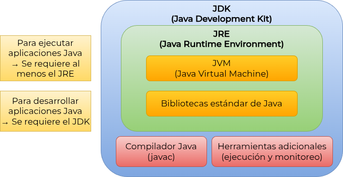
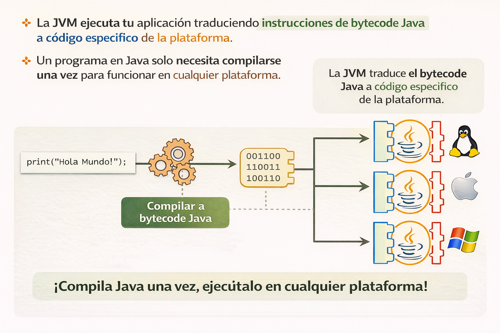

# 1. Java Fundamentos - Introducción 

## 1.1 Origen y evolución

* Java es un lenguaje orientado a objetos de la misma familia de lenguajes como C, C++ y C#.
* Originalmente diseñado para ser empleado en aparatos electrónicos. El objetivo era escribir el código una sola vez y ejecutarlo en diversos dispositivos electrónicos con distintas compatibilidades, es decir, resolver problemas de compatibilidad entre dispositivos (hardware y software)
* Actualmente empleado en una gran cantidad de dispositivos, micro y hasta en grandes sistemas.

### 1.1.1 Historia de versiones en Java

* Java fue desarrollado por James Gosling y su equipo en Sun Microsystems en 1991.
* La primera versión de Java, incluida en el llamado JDK (Java Development Kit), fue lanzada en 1996 (JDK 1.0).
* Oracle adquiere Sun Microsystems en 2010. En 2011 se libera el JDK 7.
* En 2014 se libera el JDK 8, una de las versiones más populares y ampliamente adoptadas por la gran cantidad de características nuevas que incluye.
* A partir de Java 11, Oracle libera versiones LTS (Long-Term Support) cada 3 años.
* JDK 11 (2018) y JDK 17 (2022) son versiones LTS.

### 1.1.2 La tecnología Java y grupos de productos

Java no es sólo un lenguaje de programación, sino un entorno tecnológico completo que incluye varios productos:
* **Java SE** (Standard Edition): Es la versión estándar de Java, que incluye las
  funcionalidades básicas del lenguaje, como el entorno de ejecución y las bibliotecas
  estándar.
* **Jakarta EE** (Enterprise Edition): Conocido anteriormente como Java EE, es una extensión de Java SE que incluye herramientas y APIs para el desarrollo de aplicaciones empresariales que corren en grandes servidores distribuidos.
* **Java ME** (Micro Edition): Es una versión reducida de Java destinada a dispositivos móviles y sistemas embebidos con recursos limitados.

## 1.2 JDK, JRE y JVM

* Las liberaciones o versiones de Java se identifican  por el JDK (Java Development Kit).
* El JDK está formado por los siguientes elementos principales:
  * JRE (Java Runtime Environment)
  * Compilador de Java (`javac`)
  * Herramienta interactiva para probar de forma rápida código Java sin tener que crear clases completas (comando `jshell`)
* El JDK se puede descargar desde el [sitio oficial de Oracle](https://www.oracle.com/java/technologies/downloads) o utilizar distribuciones alternativas como OpenJDK.
  * Herramientas adicionales para depuración, documentación y empaquetado de aplicaciones.
  * Herramientas adicionales para monitoreo de aplicaciones Java.
* El JRE es un entorno que permite ejecutar aplicaciones Java en una plataforma
  específica: Windows, Linux, Mac, etc. Incluye los siguientes elementos:
  * La JVM es una máquina virtual encargada de interpretar y ejecutar el código Java.
  * El API de Java

A partir de la versión JDK 11, el JRE ya no se distribuye como un paquete independiente,
  sino que está incluido dentro del JDK.

<p align="center"> </p>

## 1.3 Plataforma Java

* Una plataforma representa el entorno en hardware o software en el que un progr ama se ejecuta.
* La mayoría de las plataformas se describen como la combinación de ambos elementos: hardware y software (sistemas operativos).
* La plataforma Java esta basada únicamente en **software** y se ejecuta en diversas
  arquitecturas de Hardware. Esta formada por los siguientes elementos:
  * Un programa en Java que se compila una sola vez.
  * El compilador de Java produce *byte-code* para ser interpretado por la JVM (Java Virtual Machine).
  * La JVM es un software o aplicación creada para una plataforma en particular.
  * La JVM ejecuta los programas a partir de la traducción de los *byte-codes* en código específico para su plataforma.
* Todos los elementos anteriores permiten interpretar el siguiente requerimiento asociado con portabilidad.
  * **Un programa en Java requiere ser compilado una sola vez y debe funcionar en cualquier plataforma**

<p align="center"> </p>

## 1.4 ¿Cómo se produce  y ejecuta un programa en Java ?

1. El programa es escrito por un desarrollador en forma de código de alto nivel.
2. El programa es transformado de forma que una máquina lo pueda ejecutar. Esto puede
   ocurrir de 2 formas posibles:
    1. Código interpretado: Generar código máquina al vuelo y ejecutar de forma dinámica.
       Cada instrucción se ejecuta conforme se va realizando la transformación.
    2. Código compilado: Produce código máquina a partir de un compilador que permite
       ejecutar de forma más rápida aplicando diversas optimizaciones. Un código
       interpretado no se pude optimizar debido a la traducción y ejecución simultánea. El
       código máquina es dependiente de la plataforma donde se ejecuta (Win, Linux, Mac),
       por lo que se tiene que generar código para cada plataforma, con instrucciones
       binarias diferentes. Ambas técnicas de transformación tienen sus áreas de
  oportunidad, cada una tiene ventajas y desventajas.

<p align="center"> </p>

### 1.4.1  Código fuente de un programa en Java

* El código fuente en Java se escribe en archivos de texto con extensión `.java`.
* Cada archivo `.java` es en sí mismo una clase y cuyo nombre debe coincidir con el nombre de la clase declara en el código. Ejemplo:

```java
public class Saludo {
    public static void main(String[] args) {
        saluda();
    }
    
    public static void saluda() {
        System.out.println("¡Hola! Bienvenido al mundo de Java.");
    }
}
```

* El código anterior contempla una clase llamada "Saludo", que implementa dos métodos, uno es `main` y la otra `saluda`. Todo este código se guarda en un archivo nombrado como *Saludo.java*. Para compilar el programa, de la forma más simple, se ejecuta la siguiente instrucción:

```bash
# Comando para invocar al compilador de Java: javac
javac Saludo.java
```

* Los *byte-codes* del código anterior serán generados por el compilador en un archivo llamado *Saludo.class*
* Para ejecutar el programa, solicitamos a la JVM -de una plataforma en particular- realizar la ejecución empleando el comando `java` seguido del nombre de la clase (archivo) que deseamos ejecutar (el debe definir un método `main`).
* Aunque en realidad se usa un archivo `.class` para ejecutar el comando, se omite esta parte al momento de ejecutar el comando.

```bash
java Saludo
```

* La JVM interpreta el código compilado y optimizado  representado por los byte-codes,
  transformándolo en código máquina para su correspondiente plataforma.
* Existe una forma alternativa de ejecutar el código Java directamente sin realizar la compilación de forma explicita. La JVM en este caso realiza el proceso de compilación implícitamente, resultando en un código con un menor grado de optimización.

<p align="center"> </p>

### 1.4.2 [Java code conventions](https://www.oracle.com/java/technologies/javase/codeconventions-contents.html)

* Son un conjunto de reglas y recomendaciones para escribir código Java de manera consistente y legible.
* Algunos ejemplos de estas convenciones incluyen:
  * Los nombres de clases en mayúscula inicial (*CamelCase*), por ejemplo: `AsiEsUnaClase`.
  * Los nombres de métodos y variables inician con minúscula y cada palabra adicional, inicia con mayúscula, por ejemplo: `estoEsUnMétodo()`
  * Uso adecuado de espacios y sangrías para mejorar la legibilidad (para este curso, en lugar de tabulaciones, se prefiere el uso de 2 espacios).
  * Comentarios claros y concisos para explicar el propósito del código.
* Seguir estas convenciones facilita la colaboración entre desarrolladores y mejora la mantenibilidad del código.

## 1.5 Vocabulario básico en Java

* Formado por los siguientes elementos:
  * *Java keywords* o palabras reservadas
  * Literales
* Todas se representan en minúsculas
* No pueden ser empleadas como identificadores. Ejemplos
* palabras reservadas para flujo de control
  * `if`, `else`, `continue`, etc.
* Estructura del código
  * `private`, `public`, `import`, `package`,`class`, `static`, `final`, `return`, `void`
* Tipos de datos
  * `byte`, `int`, `short`, `double`, `var`
* Trabajando con objetos
  * `new`, `this`, `super`
* Literales
  * `true`, `false`, `null`
* Manejo de excepciones
  * `try`, `catch`, `throw`, `throws`

### 1.5.1 Sintaxis básica

* Java es un lenguaje sensible a mayúsculas y minúsculas (conocido como *case sensitive*)
* El método principal es `main()`, punto de entrada de la aplicación
* Cada instrucción termina con un punto y coma `;`
* Los bloques de código se definen con llaves `{ }`
* Los comentarios pueden ser de una sola línea o múltiples líneas

```java
// Este comentario es de una línea
/* Este comentario
		es de varias líneas,
		pero sólo se indica inicio y cierre
*/
```

* Clases contienen métodos y atributos


<p align="center"></p>

### 1.6 Creando aplicaciones Java

* Cualquier aplicación Java debe contener al menos una clase y siempre con un método `main()`, que debe tener al menos la siguiente sintaxis para ser reconocido por la JVM:

```java
// Sintaxis moderna (y mínima)
void main(){
    // Código de la aplicación
}

// Sintaxis convencional y completa,
// ejemplifica de mejor forma el uso de Java
public static void main(String[] args) {
    // código de la aplicación
}
```

* `public`: el método es accesible desde cualquier parte
* `static`: el método puede ser invocado sin crear una instancia de la clase
* `void`: el método no retorna ningún valor
* `String[] args`: un arreglo de cadenas que puede recibir argumentos desde la línea de comandos al ejecutar la aplicación.  Ejemplo:

```java
    public class MiAplicacion {
        public static void main(String[] args) {
            System.out.println("Número de argumentos: " + args.length);
            for (String arg : args) {
                System.out.println(arg);
            }
        }
    }
```

* Al ejecutar la aplicación desde la línea de comandos, se pueden pasar argumentos

```bash
    java MiAplicacion arg1 arg2 arg3
```

* Salida esperada:

```bash
    Número de argumentos: 3
    arg1
    arg2
    arg3
```

### 1.6.1 Entrada y salida estándar

Estos temas son fundamentales para interactuar con el usuario a través de la consola, solo se mencionan para tener una idea básica de su funcionamiento del programa anterior, pero revisarán más adelante.

* Java proporciona la clase `System` para manejar la entrada y salida estándar
* `System.out` es un objeto de la clase `PrintStream` utilizado para imprimir en
  la consola
* Métodos comunes:
  * `System.out.println()`: imprime una línea con un salto de línea al final
  * `System.out.print()`: imprime sin salto de línea
* `System.in` es un objeto de la clase `InputStream` utilizado para leer
  entrada desde la consola.
* `System.err` es un objeto de la clase `PrintStream` utilizado para imprimir
  mensajes de error en la consola.

Ejemplo de uso de los 3 métodos:

```java
import java.util.Scanner;

public class EntradaSalida {
    public static void main(String[] args) {
        // Imprimir en la consola
        System.out.println("Bienvenido a Java!");
        System.out.print("Por favor, ingresa tu nombre: ");

        // Leer entrada desde la consola
        Scanner scanner = new Scanner(System.in);
        String nombre = scanner.nextLine();

        // Imprimir mensaje de error (si el nombre está vacío)
        if (nombre.isEmpty()) {
            System.err.println("Error: El nombre no puede estar vacío.");
        } else {
            System.out.println("Hola, " + nombre + "!");
        }

        scanner.close();
    }
}
```

## 1.7 API, paquetes y la variable CLASSPATH

### 1.7.1 API de Java

El API (Application Programming Interface) de Java es un conjunto de clases y bibliotecas
que proporcionan funcionalidades predefinidas para facilitar el desarrollo de aplicaciones. El API está organizado en paquetes, que son grupos lógicos de clases relacionadas. 
Algunos paquetes comunes en el API de Java incluyen:

* `java.lang`: Contiene clases fundamentales como `String`, `Math`, `System`, etc.
* `java.util`: Proporciona clases para estructuras de datos, colecciones, fechas, etc.
* `java.io`: Incluye clases para manejo de entrada y salida, como archivos y flujos de datos.
* `java.net`: Contiene clases para programación de redes y comunicación a través de sockets.
El API de Java esta totalmente documentado y se puede consultar en línea en el sitio oficial de Oracle: [Java SE API Documentation](https://docs.oracle.com/en/java/javase/).
Este formato de documentación es conocido como Javadoc y puede generarse automáticamente a partir del código fuente utilizando la herramienta `javadoc`.

### 1.7.2 Paquetes en Java

* Los paquetes representan una forma de organizar y agrupar clases relacionadas.
* Ayudan a evitar conflictos de nombres y facilitan la gestión del código.
* Permiten controlar el acceso a las clases mediante modificadores de acceso.
* Permiten reutilizar código y facilitar la colaboración en proyectos grandes.
* Se definen al inicio de un archivo Java utilizando la palabra clave `package`.
* Ejemplo de definición de un paquete:

```java
    package edu.unam.cursos.java.intro;

    public class MiClaseIntro {
        // código de la clase
    }
```

* Cuando una clase  hace uso de otra que no se encuentra en su propio paquete, es necesario importar la clase o el paquete correspondiente utilizando la palabra clave
  `import`. Ejemplo:

    ```java
    import java.util.ArrayList;

    public class MiClase {
        public static void main(String[] args) {
            ArrayList<String> lista = new ArrayList<>();
            lista.add("Elemento 1");
            lista.add("Elemento 2");
            System.out.println(lista);
        }
    }
    ```

* El ejemplo anterior importa la clase `ArrayList` del paquete `java.util` para utilizarla
  en la clase `MiClase`. Otra forma de importar todas las clases de un paquete es utilizando el asterisco `*` por ejemplo, `import java.util.*;`

* El nombre del paquete debe coincidir con la estructura de directorios donde se encuentra el archivo `.java`. Por ejemplo, si la clase `MiClase` está en el paquete `edu.unam.cursos.java.intro`, el archivo debe estar ubicado en la ruta   `edu/unam/cursos/java/intro/MiClase.java`.

  ```bash
  src/
  └── edu/
      └── unam/
          └── cursos/
              └── java/
                  └── intro/
                      └── Alumno.java

  ```

* Las buenas prácticas relacionadas con el concepto de paquetes recomiendan:
  * Utilizar nombres de paquetes en minúsculas
  * Definir la estructura del paquete (carpetas), según el dominio invertido de la organización, es decir, de lo particular, a lo general, por ejemplo: `com.ejemplo.proyecto`.
  * No hacer uso de clases sin definir paquetes, ya que se colocan en el paquete por defecto llamado `default package`, lo que puede generar conflictos de nombres y dificultar la organización del código.
* Para facilitar la creación, compilación y ejecución de programas Java con paquetes, es
  recomendable utilizar un IDE o herramientas de construcción como Maven o Gradle.

### 1.3 Variable de entorno `CLASSPATH`

* Esta variable le indica a la JVM dónde buscar las clases y paquetes necesarios para compilar y ejecutar una aplicación Java.
* Puede incluir rutas a directorios o archivos JAR que contienen las clases y paquetes requeridos. Un archivo JAR (Java ARchive) es un formato de archivo que agrupa múltiples archivos relacionados, como clases y recursos, en un solo archivo comprimido.
* Para compilar o ejecutar un programa, el compilador y la JVM respectivamente buscan las clases en los siguientes lugares:
  1. El directorio actual (donde se ejecuta el comando `java`)
  2. Las rutas especificadas en la variable `CLASSPATH`
  3. Las bibliotecas estándar de Java (incluidas en el JDK/JRE)
  4. Si una clase no se encuentra, se producirá un error de `ClassNotFoundException`.

* Definir la variable `CLASSPATH`,  puede realizarse de 2 formas:

    1. Temporalmente, mediante la línea de comandos:

```bash
# Para compilar un programa
javac -cp ruta1:ruta2 MiClase.java

#Para ejecutar un programa
java -cp ruta1:ruta2 MiClase
```

2. De manera permanente en el sistema operativo (poco usual y no recomendado)

```bash
export CLASSPATH=ruta1:ruta2
```

## 1.8 Herramientas e IDEs de desarrollo

### 1.8.1 Entornos de desarrollo integrados (IDEs)

* Existen diversas herramientas para crear aplicaciones en Java, desde el bloc de notas y hasta editores de texto, hasta entornos de desarrollo integrados (IDEs) completos. Algunas de las opciones más populares son:
	* IntelliJ IDEA
	* Eclipse
	* NetBeans

### 1.8.2 Compilación y ejecución desde la línea de comandos

* Java incorpora herramientas de línea de comandos para compilar y ejecutar aplicaciones, aunque para ambientes profesionales, es común utilizar IDEs que integran estas
  herramientas de forma automática, facilitando el proceso de compilación y ejecución, sin
  embargo, es importante conocer su funcionamiento básico a linea de comandos.

#### 1.8.2.1 Compilación a línea de comandos

```shell
  javac <options> <source files>
```

Opciones comunes del comando `javac`:

Opción | Descripción |
--------- | ---------- |
 `-cp` | Configurar la variable de entorno CLASSPATH |
 `-d` | Directorio en el que se colocan los archivos `.class` compilados |

Ejemplos:

```shell
  # Compilar un solo archivo Java
  javac MiClase.java

  # Compilar múltiples archivos Java
  javac Clase1.java Clase2.java Clase3.java

  # Compilar todos los archivos Java en un directorio
  javac *.java

  # Compilar archivos Java y especificar el directorio de salida para los archivos .class
  javac -d out Clase1.java Clase2.java

  # Compilar archivos Java con una ruta específica en el CLASSPATH
  # Observar el uso del punto (.) al final para incluir el directorio actual
  javac -cp lib/milib.jar:. MiClase.java
```

#### 1.8.2.2 Ejecución a línea de comandos
  
```shell
java <options> <main class> [args...]
```

Opciones comunes del comando `java`:

Opción | Descripción |
--------- | ---------- |
[args...] | Argumentos que se pasan al método `main` de la clase principal |
 `-cp` | Empleada para configurar la variable de entorno CLASSPATH |

Ejemplos:

```shell
  # Ejecutar una clase Java
  java MiClase

  # Ejecutar una clase Java con argumentos
  java MiClase arg1 arg2 arg3

  # Ejecutar una clase Java con una ruta específica en el CLASSPATH
  # Observar el uso del punto (.) al final para incluir el directorio actual
  java -cp lib/milib.jar:. MiClase
```

#### 1.8.3 JShell

* Herramienta interactiva que permite ejecutar código Java de forma
  rápida sin necesidad de crear clases completas.
* Permite probar fragmentos de código, experimentar con nuevas características del
  lenguaje y aprender Java de manera interactiva.
* Para iniciar JShell, simplemente ejecuta el comando `jshell` en la terminal. Ejemplo:

```bash
    jshell
    jshell> System.out.println("Hola desde JShell!");
    Hola desde JShell!
    jshell> int x = 10
    x ==> 10
    jshell> int y = 20
    y ==> 20
    jshell> x + y
    $3 ==> 30
    jshell> /exit
```

* JShell realiza las siguientes 3 acciones principales de forma repetitiva:
  1. Lee la entrada del usuario
  2. Evalúa el código ingresado
  3. Muestra el resultado o cualquier mensaje de error
* Para salir de JShell, simplemente escribe `exit()` o presiona `Ctrl + D`.
* JShell está disponible a partir de Java 9 en adelante.
* Principales comandos de JShell:
  * `/help`: Muestra la ayuda con los comandos disponibles
  * `/vars`: Lista las variables definidas en la sesión actual
  * `/methods`: Lista los métodos definidos en la sesión actual
  * `/types`: Lista los tipos (clases, interfaces) definidos en la sesión actual
  * `/list`: Muestra el historial de comandos ingresados
  * `/reset`: Reinicia la sesión, eliminando todas las definiciones actuales
  * `/exit`: Sale de JShell

## 1.9 Práctica 

Para mayores detalles  sobre la realización de las prácticas propuestas, consultar el
documento correspondiente ubicado en  esta misma carpeta. 

### 1.9.1 Instalar y configurar el ambiente de desarrollo Java

* Descargar e instalar el JDK mas reciente desde el sitio oficial de Oracle.
* Configurar las variables de entorno `JAVA_HOME` y `PATH` para que apunten a la
  instalación del JDK.
* Comprobar la instalación ejecutando los comandos `java -version` y `javac -version` en la terminal.

### 1.9.2 Interactuar con JShell

* Iniciar JShell desde la terminal ejecutando el comando `jshell`.
* Probar algunos de los siguientes comandos en JShell:
  * Definir variables de diferentes tipos (`int`, `double`, `String`).
  * Crear y llamar a métodos simples.
  * Utilizar estructuras de control como `if`, `for`, y `while`.

### 1.9.3 Ejecutar una aplicación simple desde la línea de comandos

* Crear una clase con una estructura de paquetes adecuada `edu.unam.cursos.java.intro`
* Implementar un método `main` que imprima "¡Hola, Mundo!" en la consola.
* Compilar la clase utilizando el comando `javac`.
* Ejecutar la aplicación utilizando el comando `java` y verificar la salida.

### 1.9.4 Crear y ejecutar una aplicación que haga uso de varias clases

1) Definir una clase principal que implemente el método `main()`.
2) Crear otra clase en el mismo paquete que la clase anterior.
3) Crear una clase más, en un paquete diferente
4) Crear una clase que no tenga paquetes definidos (*default package*).
5) Crear un archivo JAR que incluya una tercer clase, en un paquete diferente
6) Todas las clases anteriores deben ser implementadas desde la clase principal
7) Compilar todas las clases utilizando el comando `javac`, cerciorándose de incluir las rutas necesarias en la variable `CLASSPATH`
8) Ejecutar la aplicación mediante el comando `java`. Asegurarse de incluir las rutas necesarias en la variable `CLASSPATH`. Verificar la salida.

Un escenario posible de la estructura de archivos es el siguiente:

  ```java
  src/
  └── edu/
  |   └── unam/
  |       └── cursos/
  |           └── java/
  |               └── intro/
  |                   ├── AplicacionPrincipal.java
  |                   ├── ClaseAdicional.java
  |                   └── extra/
  |                       └── Utilidad.java
  └── OtraClase.java
  ```

  * El archivo JAR puede llamarse `libreria.jar` y contener una clase adicional en un paquete diferente, por ejemplo, `com.ejemplo.libreria.OtraClase`.
  * Un  caso de estudio  podría ser una aplicación de mensajes que utilice otras clases para imprimir saludos en diferentes idiomas. Proponer clases como `SaludoEspañol`, `SaludoIngles`, etc.

### 1.9.5 Instalar y configurar IntelliJ IDEA

* Descargar e instalar IntelliJ IDEA desde el sitio oficial de JetBrains.
* Configurar un nuevo proyecto Java en IntelliJ IDEA.
* Crear una clase con una estructura de paquetes adecuada
  `edu.unam.cursos.java.intro.ide`,  con un método `main` que imprima "¡Hola, Mundo!" en
  la consola.
* Ejecutar la aplicación desde IntelliJ IDEA y verificar la salida.