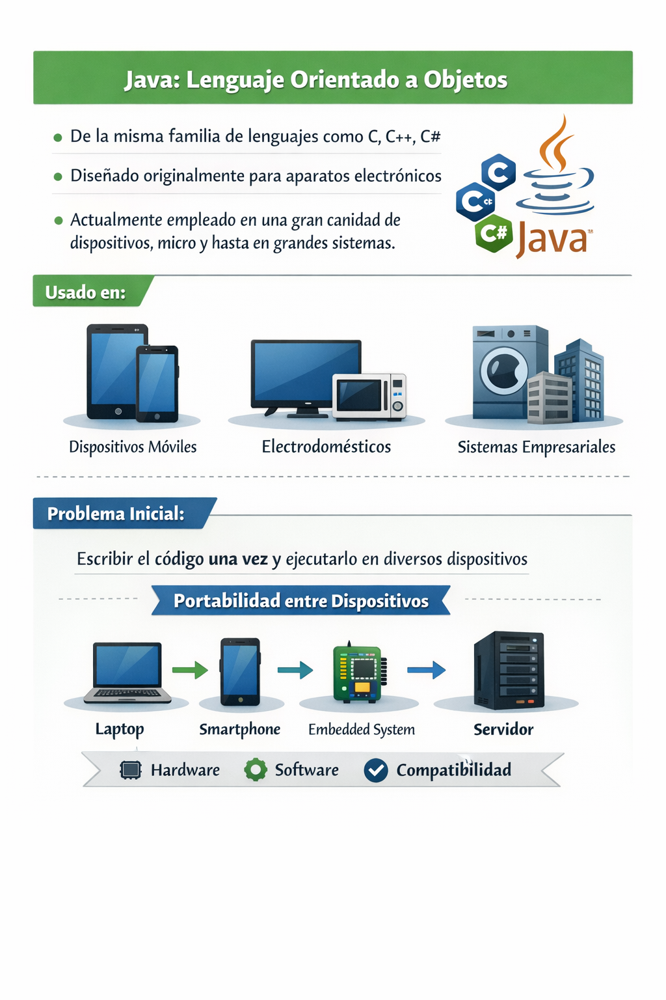
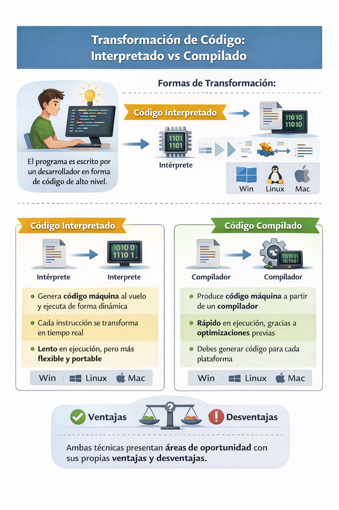
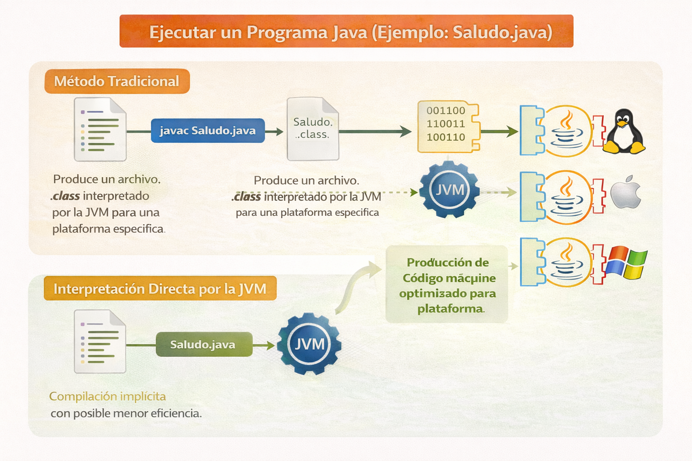
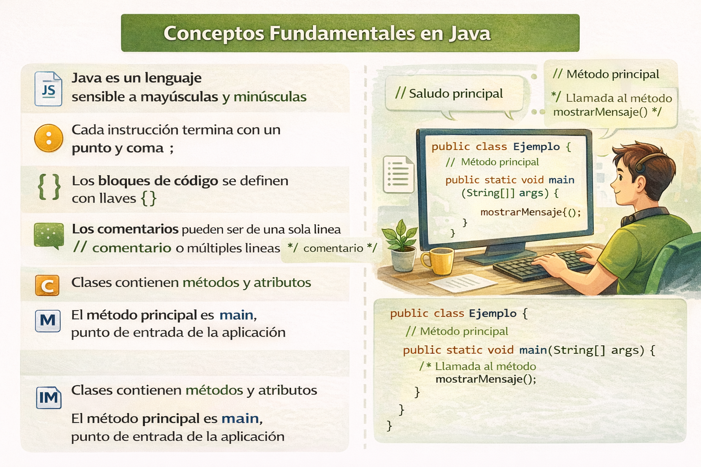

# 1. Java Fundamentos - Introducción

## 1.1 Origen y evolución

* Java es un lenguaje orientado a objetos de la misma familia de lenguajes como C, C++, C#
* Originalmente diseñado para ser empleado en aparatos electrónicos.
* Actualmente empleado en una gran cantidad de dispositivos, micro y hasta en grandes sistemas.
* El problema a resolver inicial fue, escribir el código una sola vez, y ejecutarlo
  en diversos dispositivos electrónicos con distintas compatibilidades, es decir,
  resolver el problema de portabilidad entre dispositivos (hardware, software, etc.).

<p align="center"> </p>

### ¿Cómo se produce  y ejecuta un programa en Java ?

1. El programa es escrito por un desarrollador en forma de código de alto nivel.
2. El programa es transformado de tal forma que una máquina lo pueda ejecutar. Esto puede
   ocurrir de 2 formas posibles:
    1. Código interpretado: Generar código máquina al vuelo y ejecutar de forma dinámica.
       Cada instrucción se ejecuta conforme se va realizando la transformación.
    2. Código compilado: Produce código máquina a partir de un compilador que permite
       ejecutar de forma más rápida aplicando diversas optimizaciones. Un código
       interpretado no se pude optimizar debido a la traducción y ejecución simultánea. El
       código máquina es dependiente de la plataforma donde se ejecuta (Win, Linux, Mac),
       por lo que se tiene que generar código para cada plataforma, con instrucciones
       binarias diferentes. Ambas técnicas de transformación tienen sus áreas de
  oportunidad, cada una tiene ventajas y desventajas.

<p align="center"> </p>

## 1.3 Plataforma Java

* Una plataforma representa el entorno en hardware o software en el que un programa se
  ejecuta.
* La mayoría de las plataformas se describen como la combinación de ambos elementos:
  hardware y software (sistemas operativos).
* La plataforma Java esta basada únicamente en **software** y se ejecuta en diversas
  arquitecturas de Hardware. Esta formada por los siguientes elementos:
  * Un programa en Java necesita ser compilado una sola vez.
  * El compilador de Java produce byte-codes para ser interpretados por la JVM (Java
    Virtual Machine).
  * la JVM es un software o aplicación creada para una plataforma en particular.
  * La JVM ejecuta los programas Java a partir de la traducción de los byte-codes en
    código específico para su plataforma.
* Todos los elementos anteriores permiten interpretar el siguiente requerimiento asociado
  con portabilidad.
  * **Un programa en Java requiere ser compilado una sola vez y debe funcionar en
    cualquier plataforma**

<p align="center"> </p>

### 1.3.1  Programas en Java

* El código fuente en Java se escribe en archivos de texto con extensión `.java`
* Cada archivo representa a una clase en particular cuyo nombre debe coincidir
  con el nombre de la clase. Ejemplo:

    ```java
      public class Saludo {

        public static void main(String[] args) {
          saluda();
        }

        public static void saluda() {
          System.out.println("¡Hola! Bienvenido al mundo de Java.");
        }
    }

    ```

* El código anterior debe guardarse en un archivo llamado `Saludo.java`. En su forma más
  básica, para compilar el programa se ejecuta la siguiente instrucción

  ```bash
  #javac es el comando que invoca al compilador de Java
  javac Saludo.java
  ```

* Los byte-codes del código anterior serán generados por el compilador en un archivo
  llamado `Saludo.class`
* Para ejecutar el programa, solicitamos a la JVM de una plataforma en particular realizar
  la ejecución empleando el comando `java` seguido del nombre de la clase que deseamos
  ejecutar (debe definir un método `main`)

    ```bash
    java Saludo
    ```

* La JVM interpreta el código compilado y optimizado  representado por los byte-codes,
  transformandolo en código máquina para su correspondiente plataforma.
* Existe una forma alternativa de ejecutar el código Java directamente sin realizar la
  compilación de forma explicita. La JVM en este caso realiza el proceso de compilación
  implicitamente, resultando en un código con un menor grado de optimización.

<p align="center"> </p>

## 1.4 Vocabulario básico en Java

* Formado por los siguientes elementos:
  * Java keywords o palabras reservadas
  * literales
* Todas se representan en minúsculas
* No pueden ser empleadas como identificadores. Ejemplos

* palabras reservadas para flujo de control
  * `if`, `else`, `continue`, etc.
* Estructura del código
  * `private`, `public`, `import`, `package`,`class`, `static`, `final`, `return`, `void`
* Tipos de datos
  * `byte`, `int`, `short`, `double`, `var`
* Trabajando con objetos
  * `new`, `this`, `super`
* Literales
  * `true`, `false`, `null`
* Manejo de excepciones
  * `try`, `catch`, `throw`, `throws`

### 1.4.1 Sintaxis básica

* Java es un lenguaje sensible a mayúsculas y minúsculas
* Cada instrucción termina con un punto y coma `;`
* Los bloques de código se definen con llaves `{ }`
* Los comentarios pueden ser de una sola línea `// comentario` o múltiples líneas
  `/* comentario */`
* Clases contienen métodos y atributos
* El método principal es `main`, punto de entrada de la aplicación

<p align="center"> </p>

### 1.4.2 Creando aplicaciones Java

* Cualquier aplicación Java debe contener al menos una clase con un método `main`
* El método `main` debe tener la siguiente firma para ser reconocido por la JVM

    ```java
    public static void main(String[] args) {
        // código de la aplicación
    }
    ```

* `public`: el método es accesible desde cualquier parte
* `static`: el método puede ser invocado sin crear una instancia de la clase
* `void`: el método no retorna ningún valor
* `String[] args`: un arreglo de cadenas que puede recibir argumentos desde la línea
  de comandos al ejecutar la aplicación.  Ejemplo:

    ```java
    public class MiAplicacion {
        public static void main(String[] args) {
            System.out.println("Número de argumentos: " + args.length);
            for (String arg : args) {
                System.out.println(arg);
            }
        }
    }
    ```

* Al ejecutar la aplicación desde la línea de comandos, se pueden pasar argumentos

    ```bash
    java MiAplicacion arg1 arg2 arg3
    ```

* Salida esperada:

    ```bash
    Número de argumentos: 3
    arg1
    arg2
    arg3
    ```

### 1.4.3 Estándar I/O en Java

* Java proporciona la clase `System` para manejar la entrada y salida estándar
* `System.out` es un objeto de la clase `PrintStream` utilizado para imprimir en
  la consola
* Métodos comunes:
  * `System.out.println()`: imprime una línea con un salto de línea al final
  * `System.out.print()`: imprime sin salto de línea
* `System.in` es un objeto de la clase `InputStream` utilizado para leer
  entrada desde la consola.
* `System.err` es un objeto de la clase `PrintStream` utilizado para imprimir
  mensajes de error en la consola.

Ejemplo de uso de los 3 métodos:

```java
import java.util.Scanner;
public class EntradaSalida {
    public static void main(String[] args) {
        // Imprimir en la consola
        System.out.println("Bienvenido a Java!");
        System.out.print("Por favor, ingresa tu nombre: ");

        // Leer entrada desde la consola
        Scanner scanner = new Scanner(System.in);
        String nombre = scanner.nextLine();

        // Imprimir mensaje de error (si el nombre está vacío)
        if (nombre.isEmpty()) {
            System.err.println("Error: El nombre no puede estar vacío.");
        } else {
            System.out.println("Hola, " + nombre + "!");
        }

        scanner.close();
    }
}
```

## 1.5. Herramientas e IDEs de desarrollo

### 1.5.1 Entornos de desarrollo integrados (IDEs)

* Existen diversas herramientas para desarrollar en Java, desde editores de texto
  simples hasta entornos de desarrollo integrados (IDEs) completos.
* Algunos IDEs populares para Java incluyen:
  * IntelliJ IDEA
  * Eclipse
  * NetBeans

### 1.5.2 Java Development Kit (JDK)

* El JDK es un conjunto de herramientas necesarias para desarrollar aplicaciones
  en Java. Incluye:
  * Compilador  representado por el comando `javac`
  * Máquina Virtual de Java (JVM) representada por el comando `java`
  * Herramienta interactiva para probar de forma rápida código Java sin tener que crear
    clases completas, representada por el comando `jshell`
  * Bibliotecas estándar de Java
  * Herramientas adicionales para depuración, documentación y empaquetado de aplicaciones.
* El JDK se puede descargar desde el sitio oficial de Oracle
  <https://www.oracle.com/java/technologies/downloads> o utilizar distribuciones
  alternativas como OpenJDK.

#### 1.5.3 JShell

* JShell es una herramienta interactiva que permite ejecutar código Java de forma
  rápida sin necesidad de crear clases completas.
* Permite probar fragmentos de código, experimentar con nuevas características del
  lenguaje y aprender Java de manera interactiva.
* Para iniciar JShell, simplemente ejecuta el comando `jshell` en la terminal. Ejemplo:

    ```bash
    jshell
    jshell> System.out.println("Hola desde JShell!");
    Hola desde JShell!
    jshell> int x = 10
    x ==> 10
    jshell> int y = 20
    y ==> 20
    jshell> x + y
    $3 ==> 30
    jshell> /exit
    ```

* JShell realiza las siguientes 3 acciones principales de forma repetitiva:
  1. Lee la entrada del usuario
  2. Evalúa el código ingresado
  3. Muestra el resultado o cualquier mensaje de error
* Para salir de JShell, simplemente escribe `exit()` o presiona `Ctrl + D`.
* JShell está disponible a partir de Java 9 en adelante.
* Principales comandos de JShell:
  * `/help`: Muestra la ayuda con los comandos disponibles
  * `/vars`: Lista las variables definidas en la sesión actual
  * `/methods`: Lista los métodos definidos en la sesión actual
  * `/types`: Lista los tipos (clases, interfaces) definidos en la sesión actual
  * `/list`: Muestra el historial de comandos ingresados
  * `/reset`: Reinicia la sesión, eliminando todas las definiciones actuales
  * `/exit`: Sale de JShell

## 1.6 Ejercicios propuestos 

### 1.6.1 Instalar y configurar el ambiente de desarrollo Java

* Descargar e instalar el JDK mas reciente desde el sitio oficial de Oracle.
* Configurar las variables de entorno `JAVA_HOME` y `PATH` para que apunten a la
  instalación del JDK.
* Verificar la instalación ejecutando los comandos `java -version` y `javac -version`
  en la terminal.

### 1.6.2 Interactuar con JShell

* Iniciar JShell desde la terminal ejecutando el comando `jshell`.
* Probar los siguientes comandos en JShell:
  * Definir variables de diferentes tipos (int, double, String).
  * Crear y llamar a métodos simples.
  * Utilizar estructuras de control como `if`, `for`, y `while`.
  * Salir de JShell utilizando el comando `/exit`.

### 1.6.3 Crear y ejecutar una aplicación Java simple a partir de la línea de comandos

* Crear una clase con una estructura de paquetes adecuada `edu.unam.cursos.java.intro`
* Implementar un método `main` que imprima "¡Hola, Mundo!" en la consola.
* Compilar la clase utilizando el comando `javac`.
* Ejecutar la aplicación utilizando el comando `java` y verificar la salida.

### 1.6.4 Instalar y configurar IntelliJ IDEA

* Descargar e instalar IntelliJ IDEA desde el sitio oficial de JetBrains.
* Configurar un nuevo proyecto Java en IntelliJ IDEA.
* Crear una clase con una estructura de paquetes adecuada
  `edu.unam.cursos.java.intro.ide`,  con un método `main` que imprima "¡Hola, Mundo!" en
  la consola.
* Ejecutar la aplicación desde IntelliJ IDEA y verificar la salida.
