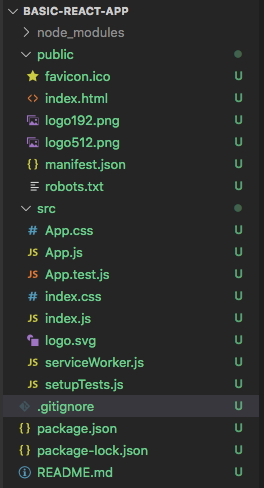
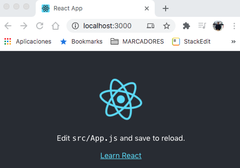

# ReactJS
## 9. Create React App
### 9.1.  Iniciando con Create React App
* Hasta este punto, todos los ejemplos que se han mostrado hacen uso de compilador Babel embebido en la misma página HTML  así como la importación manual de los scripts de ReactJS.
*  Para ejemplos simples y sencillos esta técnica es útil, pero para proyectos reales, es necesario incorporar una herramienta que permita la construcción de proyectos ReactJS de una forma sencilla y fácil de administrar en especial para el developer. 
* La construcción de una aplicación ReactJS para fines productivos requiere la implementación de ciertos requerimientos así como la ejecución de una serie de tareas repetitivas que van desde la generación, importación y programación de los componentes React, hasta su compilación, verificación y optimización.
* Lo anterior implica la existencia del llamado ***build workflow*** 
* Este workflow es implementado por herramientas diseñadas especialmente para construir aplicaciones ReactJS productivas. 
* La herramienta  que se revisará en este tutorial es Create React App.
#### 9.1.1 Características de Create React App.
* [Create React App](https://create-react-app.dev/) es una herramienta empleada para crear tanto *single-page ReactJS applications* como *multiple-page ReactJS applications*
* Las Single page ReactJS applications se basan en la presentación de una sola  página HTML dividida en diversas secciones (header, body,  footer, menus laterales, barras de herramientas, etc.), que a su vez están formadas por componentes React.
* Cada uno de estos componentes son actualizados y administrados de forma dinámica e independiente.
* En una *Single page ReactJS application*, la página es administrada completamente por ReactJS.
#### 9.1.2 Requerimientos necesarios para construir una aplicación ReactJS productiva
* Debe implementar todo el ciclo de construcción de una aplicación, es decir, debe implementar todo el *build workflow*.
* Debe generar código optimizado, adecuado para ambientes productivos del menor tamaño posible.
* Facilidad para hace uso de las nuevas funcionalidades de Javascript ES5, ES6 (Next Generation JS features).
* Estas características deben ser compiladas en código que sea compatible para la gran mayoría de browsers, en especial para los que aun no soportan estas nuevas características.
* Estas nuevas características permiten al developer escribir código compacto, entendible lo que se transforma en una mejor productividad.
* Es necesario contar con una herramienta que realice la administración de dependencias Javascript (similar a maven), por ejemplo `npm` o `yarn` . ReactJS en en sí una dependencia.
* Se requiere de una herramienta llamada ***bundler***.  Como su nombre lo indica, se encarga de ensamblar, organizar y/o empaquetar una aplicación ReactJS para que esta pueda ser ejecutada correctamente por el browser.
* A nivel de desarrollo,  los archivos de la aplicación se encuentran estructurados y organizados de una forma amigable y de fácil administración. Sin embargo, en producción, esta estructura no siempre  es compatible ni óptima.
* Un ejemplo de lo anterior: No todos los browsers soportan que el código se encuentre separado en varios archivos, tampoco sería óptimo contar con un gran número de archivos ya que se requerirán demasiadas peticiones pequeñas para obtener todos los recursos.
* El *bundler* comúnmente empleado es ***webpack***. 
* Se requiere el uso de ***Babel*** como compilador JSX y también para las nuevas funcionalidades JS.
* Finalmente, se requiere de un ***web server*** que permita realizar testing real.
* Probar la aplicación localmente con un browser es muy diferente a probarla desde un servidor web, tal cual como ocurriría en producción. 
* Esto se debe principalmente a que el uso de archivos locales habilita el uso del protocolo `file://` en lugar de usar `http://` como ocurriría en un web server real.
*  [Create React App](https://create-react-app.dev/)  implementa todos estos requisitos.
### 9.2 Configuración previa para hacer uso de Create React App.
* Las instrucciones se encuentran en el [sitio oficial de Github](https://github.com/facebook/create-react-app#creating-an-app).
* La primera actividad a realizar es la instalación de `npm` para realizar la administración de dependencias.
* `npm` está incluido como parte de la instalación de NodeJS, por lo que se requiere instalar NodeJS, el cual puede ser obtenido de este [sitio](https://nodejs.org/en/). 
* Puede ser instalado como paquete o como [binario](https://nodejs.org/en/download/)  el cual se extrae en un directorio. En este caso, asegurarse de configurar la variable `PATH`.
#### 9.2.1 Introducción a  npm y npx
* `npm`tiene diversos usos. Para efectos de este manual, esta herramienta se empleará  principalmente para realizar la administración de dependencias o paquetes Javascript.
* `npx` es otra herramienta que se incluye al instalar NodeJS. Su uso principal es la posibilidad de ejecutar o probar paquetes Javascript sin la necesidad de instalarlos localmente.
* `yarn` es otra herramienta que pueden emplearse para realizar esta misma tarea.   Para efectos del manual, se hará uso de `npx`.
* `npm`representa  aun repositorio online de paquetes en el que se pueden publicar 	proyectos Open Source escritos con Node.js. En el mundo Java el equivalente es un *Maven repository*.
* Como se mencionó anteriormente `npm`se emplea para  instalar paquetes o dependencias  así como para administrar sus versiones.  Existe una infinidad de librerías NodeJS que pueden ser empleadas en diversos proyectos.
*  Por si solo `npm`no realiza la ejecución de un paquete.  Para permitir que `npm` ejecute un paquete, se debe configurar  el archivo `package.json` y posteriormente ejecutar el comando:
```bash
npm run your-package
```
*  Otra opción es  ejecutarlo con la siguiente instrucción
```bash
$ ./node_modules/.bin/your-package
```
* El archivo `package.json` es el equivalente al archivo `pom.xml`en un proyecto Maven.
* Cuando un paquete ejecutable es instalado a través de `npm` se crean ligas para poder ser ejecutado:
	* Para instalaciones locales  las ligas se crean en  `/node_modules/.bin/`
	* Para instalaciones globales en `/usr/local/bin` para  Linux.
 * Desde la versión 5.2.0 de `npm`se incorpora `npx` con la finalidad de facilitar la administración, ejecución e instalación de dependencias. Esta herramienta es comúnmente empleada.
 #### 9.2.2 Instalación de NodeJS, npx
 Para efectos de este material se realizarán las siguientes acciones. Se prefiere realizar una instalación local dentro de un directorio para tener mayor control y evitar la copia de archivos en rutas del sistema como `/usr/local/bin`, etc.
 * Descargar NodeJS del [sitio](https://nodejs.org/en/download/) indicado anteriormente.  Seleccionar el archivo binario (zip o tar.xz).
 * Extraer el contenido del archivo en algún directorio, por ejemplo en `/opt`
 ##### Ejemplo:
 * Sustituir `<version>` con la versión correspondiente.
 ```bash
 ls /opt/node-<version>
 CHANGELOG.md  LICENSE  README.md  bin  include  lib  share
 ```
 * Configurar la variable `PATH` para incluir al directorio `bin`.   La variable se deberá configurar en el script correspondiente dependiendo el sistema operativo, por ejemplo `/etc/profile.d/`, `/etc/bash.bashrc`, etc.
 ```bash
 #NodeJS
NODE_HOME=/opt/node-<version>
export PATH=$NODE_HOME/bin:$PATH
 ```
 El siguiente  paso es opcional, pero puede configurarse si se desea que los archivos que genere `npm`o  `npx` no se almacenen en el directorio `home`del usuario,  en especial si se tiene problemas de espacio. 
* Crear en caso de no existir el archivo `.npmrc` en el directorio `home`del usuario de desarrollo.  En el siguiente ejemplo e emplea `nano`, usar otro editor en caso de ser necesario.
```bash
nano ~/.npmrc
```
* Configurar las variables `prefix`y `cache`para personalizar las rutas donde se realizarán las descargas.
##### Ejemplo:
* Cambiar las rutas según sea necesario. Asegurarse que el usuario que se empleará para ejecutar `npm`y `npx`tenga permisos de escritura.
```bash
#Ruta en la que se guardarán los paquetes o dependencias
prefix=/Volumes/PROYS/config/node/npm-packages
#Ruta donde se guardan archivos empleados como caché.
cache=/Volumes/PROYS/config/node/cache
```
* Por default los paquetes se guardan en el directorio donde está instalado `node`,  por ejemplo en `/opt/node-<version>` . Se puede usar este valor, solo asegurarse que el usuario tenga permisos de escritura sobre este directorio.
* El directorio de cache por default se ubica en el directorio `home`del usuario  `~/.npm`.
A nivel general,  `npm` se configura empleando la siguiente jerarquía de archivos:   
* Archivo de configuración por proyecto (`/path/to/my/project/.npmrc`)
* Archivo de configuración por usuario (default en  `$HOME/.npmrc`)
	* De forma adicional empleando la opción  `--userconfig` 
	* Empleando también la variable  `$NPM_CONFIG_USERCONFIG`
* Archivo de configuración global (default en  `$PREFIX/etc/npmrc`)
	*  De forma adicional empleando la opción option  `--globalconfig`
	* Empleando la variable `$NPM_CONFIG_GLOBALCONFIG`
* En el archivo `npmrc` dentro del directorio de instalación de node `/path/to/npm/npmrc`
* Para comprobar la configuración, ejecutar los siguientes comandos para mostrar las versiones instaladas.
```bash
$ node -v
$ npm -v
$ npx -v
```
### 9.3 Crear un proyecto ReactJS con Create React App
* Ejecutar el siguiente comando para crear una nueva aplicación React. llamada `basic-react-app`
```bash
npx create-react-app  basic-react-app
```
* Una vez que el comando anterior termine la construcción de la aplicación, se generará una carpeta llamada `basic-react-app`con la estructura mostrada en la siguiente imagen.
  



*   `package-lock.json` Archivo que normalmente no se modifica. Contiene la administración de las versiones de las dependencias del proyecto.
* `package.json` Contiene las dependencias del proyecto.  Por ejemplo, se pude apreciar las dependencias que corresponden a ReactJS:
```json
{
  "name": "basic-react-app",
  "version": "0.1.0",
  "private": true,
  "dependencies": {
    "@testing-library/jest-dom": "^4.2.4",
    "@testing-library/react": "^9.5.0",
    "@testing-library/user-event": "^7.2.1",
    "react": "^16.13.1",
    "react-dom": "^16.13.1",
    "react-scripts": "3.4.1"
  },
  ...
  ```
  * `node_modules` contiene todas las descargas que corresponden con las dependencias del proyecto.  En `package.json` solo se definen unas cuantas, pero todas las demás son transitivas.  De forma similar, esta carpeta es generada por `npm`, no requiere ser actualizada y tampoco requiere ser incluida en el sistema de control de versiones ya sea `git` o cualquier otro.  
  * Notar que también el proyecto incluye  al archivo `.gitignore` en el que justamente se configuran los archivos y carpetas que no requieren control de versiones.
  * `public` Representa a la carpeta raíz o *root folder* ubicada en el web server que contiene todos los archivos visibles de la aplicación, por ejemplo `index.html`.
  * `index.html` Notar que para aplicaciones tipo *single page*  no es necesario agregar más archivos HTML ya que todo es generado de forma dinámica por ReactJS. Por lo tanto, solo es necesario contar con este archivo.
  *  Notar que el contenido de la App será mostrado justo en este elemento (línea  31 aprox.)
  ```html
  <div  id="root"></div>
  ```
  * Es posible agregar o importar otros scripts en`index.html`, por ejemplo, hojas de estilo, etc.
  * `manifest.json` Archivo que permite agregar capacidades a la aplicación para que esta sea considerada como una PWA application (Progressive Web App Application). Para mayores detalles consultar [aquí](https://web.dev/what-are-pwas/).
  * `src` La carpeta más importante. Básicamente contiene los archivos con los que normalmente se trabaja durante el desarrollo.
  #### 9.3.1 Contenido de la carpeta src.
  * `index.js`  Es el encargado de hacer el render de la App:
  ```jsx
import React from 'react';
import ReactDOM from 'react-dom';
import './index.css';
import App from './App';
import * as serviceWorker from './serviceWorker';

ReactDOM.render(
  <React.StrictMode>
    <App />
  </React.StrictMode>,
  document.getElementById('root')
);
...
```
* Notar que el script hace uso del componente `App`para ser mostrado dentro del elemento `<div id="root"></div>` mencionado anteriormente.
* El elemento es importado empleando  `import App from './App';`.  Esta instrucción hace referencia al archivo `App.js` que se encuentra en la misma carpeta `src`.  
* Notar que la extensión del archivo se puede omitir, pero únicamente para archivos `js`
* `App.js` Define el contenido de la aplicación por default.
```jsx
import React from 'react';
import logo from './logo.svg';
import './App.css';
function App() {
  return (
    <div className="App">
      <header className="App-header">
        
        <p>
          Edit <code>src/App.js</code> and save to reload.
        </p>
        <a className="App-link" href="https://reactjs.org"
          target="_blank" rel="noopener noreferrer">
          Learn React
        </a>
      </header>
    </div>
  );
}
export default App;
```
* Observar el uso de `import`para hacer referencia a recursos como hojas de estilo o imágenes que se encuentran dentro de la carpeta `src`.
* Al final del script se incluye la instrucción `export default App;` . Esto significa que el componente `App`que se ha definido en este script podrá ser reutilizado por otros scripts empleando la instrucción `import`.
* Para verificar el contenido de la aplicación, ejecutar las siguientes instrucciones para iniciarla:
```bash
cd basic-react-app
npm start
```
* La instrucción anterior generará una instancia de un servidor web de desarollo. La aplicación podrá visualizarse en [http://localhost:3000/](http://localhost:3000/)
* El contenido por default se muestra en la siguiente imagen:



* Una funcionalidad útil que tiene esta herramienta es que al hacer cualquier cambio en los archivos y al guardarlos, estos serán reflejados automáticamente en el browser.  Por ejemplo, modificar el archivo `App.js` con el siguiente contenido, salvar y verificar los cambios en el browser.
```jsx
    <div className="App">
      <header className="App-header">
        Hola Mundo con ReactJS
      </header>
    </div>
```
* Los archivos `index.css`y `App.css`contienen definiciones que aplican de forma global. Su contenido puede ser eliminado o modificado con base a los estilos de la propia aplicación.
* `serviceWorker.js`  Se emplea para implementar funcionalidades  que le permitan a la aplicación ser etiquetada como una PWA application (Progressive Web App Application). Básicamente permite generar un pre-caché de los archivos de la App para mejorar desempeño.
* Finalmente, el archivo `setupTests.js` permite configurar pruebas unitarias para los componentes que integren a la aplicación.  Este concepto se revisará más adelante.
##### fin de modulo.
