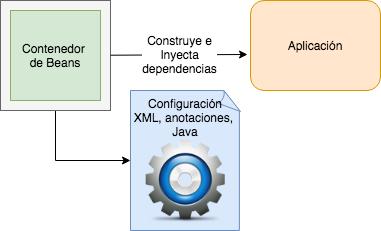
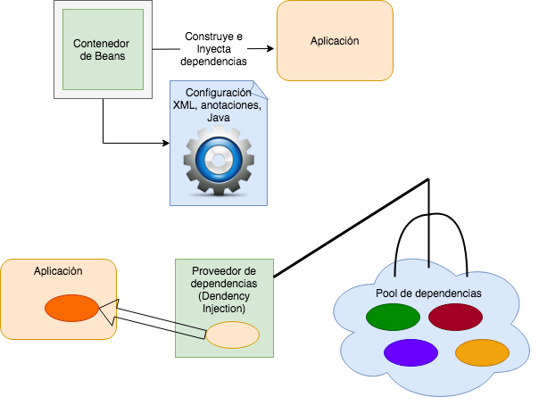
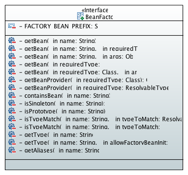
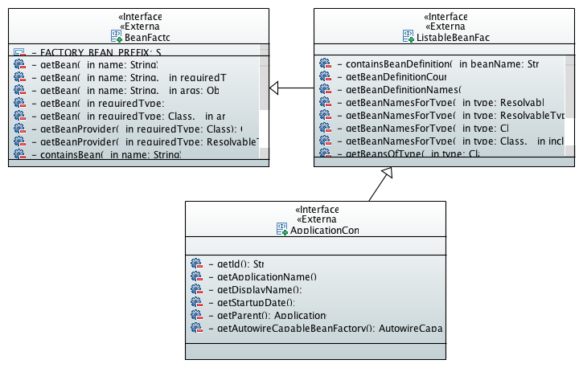

# Spring Framework
## 1. Conceptos básicos
### 1.1 ¿Qué es Spring?
* Spring es un framework Open Source escrito en Java presentado y desarrollado en 2004. 
* Las ideas principales fueron concebidas por el experimentado arquitecto JEE,  Rod Johnson.

<div  style="text-align: center;">
  
</div>

* En sus inicios representó una alternativa y complemento para el desarrollo JEE basado en los siguientes principios:
	* Java EE es ‘complicado’ en particular en versiones  J2EE 1.4 hacia atrás.
	* Se prefiere un desarrollo  basado en modelo ágiles
	* Se prefiere un Proceso de desarrollo integrado
	* Diseño OO enfocado al negocio y no en la infraestructura.
	* Mejora considerablemente el proceso de *Ingeniería de software*
	* Implementa diversos Patrones de diseño, desde los más básicos hasta patrones de integración en arquitecturas empresariales.
		* Factory
		* Builder
		* Decorator
		* Service Locator
		* Mensajería, etc.
* Hoy en día su uso es muy extenso.  ***¡Spring está e todos lados!***
### 1.2 Características de Spring.
* Spring se considera como un framework “ligero” para construir aplicaciones Java modernas y empresariales en cualquier plataforma de despliegue.
* Ofrece un soporte de infraestructura pero a nivel de aplicación:
	* Spring se enfoca en el llamado ***código de plomería***.
	* Lo anterior permite que el developer se enfoque en el desarrollo de las reglas de negocio de la aplicación.
* No se requiere hacer grandes cambios, en ocasiones **ninguno (solo configuración)** para integrar Spring a una aplicación existente.
* No esta enfocado a una parte especifica de una aplicación. (web, negocio, capa de acceso a datos).
* Es ***modular***.  Esto implica que  una aplicación puede hacer uso de Spring desde partes muy específicas hasta la construcción de aplicaciones basadas completamente en el framework.
* Impacto mínimo (código no invasivo):  *Principio de la filosofía de Spring* 
* Concepto clave: ***Contenedor:***  Componente que administra el ciclo de vida de los componentes de en las aplicaciones.
* Spring ofrece capacidades avanzadas de configuración que permiten escalar una aplicación que se ejecuta desde una laptop de un developer hasta una aplicación instalada en ambientes productivos, distribuidos y complejos ***¡sin cambiar una sola línea de código!***
#### 1.2.1 Servicios empresariales.
* Spring agrega características especiales a los objetos de una aplicación para que estos puedan implementar requerimientos en especial, requerimientos ***no funcionales*** como son:  transaccionalidad,  escalabilidad, seguridad, concurrencia, etc.
* La habilitación de estas características  se realiza de forma ***declarativa*** y ***no invasiva***. 
* A estas características se les llama ***servicios empresariales***
* Estos objetos pueden ser simples POJOs, (Plain Old Java Objects). de forma declarativa y no invasiva.
##### Ejemplos:
* Hacer que un método Java se ejecute dentro de una transacción en una base de datos sin tener que manejar APIs  como JTA, ni instrucciones invasivas como `commit`, `rollback`.
* El developer no se preocupa por construir o instanciar objetos que proporcionan servicios como son conexiones a bases de datos,  servicios de mensajería, etc.
* Enviar  y recibir mensajes a un servicio de mensajería asíncrona  sin tener que lidiar con las APIs de los proveedores de dichos servicios.

Para ofrecer estas características Spring hace uso de los siguientes conceptos los cuales forman los cimientos del framework:
* Bean
* Contenedor de Beans
* AOP (Aspect Oriented Programming)
*  Dependency Injection (DI)
* Inversion Of Control (IoC)

<div style="text-align:center;">
  </img>
</div>

#### 1.2.2 Principales funcionalidades:
* *[Tecnologías Core](https://docs.spring.io/spring-framework/docs/current/spring-framework-reference/core.html)*:  Inyección de dependencias, eventos, resources, i18n, validación, data binding, type conversion, SpEL, AOP,  Manejo de excepciones simplificado.
* *[Testing](https://docs.spring.io/spring-framework/docs/current/spring-framework-reference/testing.html)*:  Mock objects, TestContext framework,  Spring MVC Test, WebTestClient.
* *[Acceso a datos](https://docs.spring.io/spring-framework/docs/current/spring-framework-reference/data-access.html)*: Transacciones, DAO support, JDBC,  ORM, Marshalling XML,
* *Web*: [Spring MVC](https://docs.spring.io/spring/docs/current/spring-framework-reference/web.html), [Spring WebFlux](https://docs.spring.io/spring/docs/current/spring-framework-reference/web-reactive.html)  frameworks.
* *[Integration](https://docs.spring.io/spring-framework/docs/current/spring-framework-reference/integration.html)*: JMS, remoting, email, tasks, scheduling, cache.
* *[Lenguajes](https://docs.spring.io/spring-framework/docs/current/spring-framework-reference/languages.html)*: Kotlin,  Groovy,  dynamic languages.
### 1.3 Inversion Of Control
* Técnica que externaliza la creación y manejo de las dependencias de componentes.
	* *Las dependencias son resueltas por el framework, no por el programador*
* IoC también es conocido como ***Dependency Injection*** (DI).
* La implementación de DI de Spring esta basado en dos conceptos clave de Java: ***JavaBeans*** e ***Interfaces***.
* En el contexto de DI, Spring actúa más como un contenedor que como un framework.
	* Nos provee instancias de clases de nuestra aplicación con todas las dependencias que ellas necesitan.
	* Usando JavaBeans se facilita esta labor del contenedor.

<div style="text-align:center;">
  </img>
</div>

#### 1.3.1 Beneficios de DI 
* Reduce el código de plomería.
	* El contenedor se encarga de muchas cosas por nosotros.
* Externalizan las dependencias.
	* No es necesario que recompilar la aplicación para alterar las dependencias.
* Administración de las dependencias en un solo sitio.
	* Toda la información de las dependencias es contenida en un solo ***repositorio***.
* Mejora la prueba del software (TDD).
	* Facilita intercambiar implementaciones.
	* Uso de ***mocks*** para probar.
	* Ejecución de pruebas muy rápidas.
* Permite mejor diseño de aplicaciones.
	* Se diseña ***orientado a interfaces***.
	* Permite concentrarse en la lógica de la aplicación, no en la implementación del framework.
### 1.3.2 El contenedor de beans de Spring (IoC Container)
* En Spring, los objetos que forman la columna vertebral de una aplicación son administrados por el contenedor IoC.
* En Spring, a dichos objetos se les conoce como ***Beans***.
* Un bean es cualquier objeto simple el cual es instanciado y administrado  por el Contenedor IoC.  Todas las dependencias configuradas del bean son también  inyectadas por el IoC.
* La definición de los Beans y sus dependencias es expresada a través de diversos mecanismos de configuración.
* Los paquetes `org.springframework.beans` y `org.springframework.context` representan y contienen la implementación del IoC.
* El contenedor es representado por  implementaciones de `org.springframework.beans.factory.BeanFactory`  
* Existen varias implementaciones de BeanFactory, la más común: `org.springframework.beans.factory.xml.XmlBeanFactory` 
	* Esta implementación permite expresar a los objetos de una aplicación así como sus relaciones en términos de XML.

<div style="text-align:center;">
  </img>
</div>

* Configuración básica con XML:
```xml
<?xml version="1.0" encoding="UTF-8"?>
<beans xmlns="http://www.springframework.org/schema/beans"
  xmlns:xsi="http://www.w3.org/2001/XMLSchema-instance"
  xsi:schemaLocation="http://www.springframework.org/schema/beans     
    https://www.springframework.org/schema/beans/spring-beans.xsd">

  <bean id="..." class="...">  
    <!-- collaborators and configuration for this bean go here -->
  </bean>
  <bean id="..." class="...">
    <!-- collaborators and configuration for this bean go here -->
  </bean>
    <!-- more bean definitions go here -->
</beans>
```
* Otros mecanismos:
	* Annotation based configuration (Spring 2.5+)
	* Java based configuration (Spring 3+)
	* Groovy Bean definition DSL ( Domain Specific Language - Spring 4+)
* Principales elementos para configurar `<bean>`
	* id
	* class
	* name
	* scope
	* constructor arguments
	* properties
	* autowiring mode
	* lazy-initialization mode
	* initialization method 
	* destruction method
#### 1.3.3 Application Context
* Un ApplicationContext extiende la funcionalidad de BeanFactory.
* Representada por la interface `org.springframework.context.ApplicationContext`
* La idea principal es integrar en forma “declarativa” la  obtención y manipulación  de  los beans  administrados por el IoC  sin tener que instanciar la fábrica en forma programática.
* Algunas implementaciones:
	* `ClasspathXmlApplicationContext`
	* `FileSystemXmlApplicationContext`
* Se apoya en el uso de algunos frameworks  que emplee dicha aplicación para cargar e instanciar la fábrica, por ejemplo:
	* Uso de ContextListener en una aplicación web para incluir la referencia de la fábrica dentro del contexto de la aplicación web: ServletContext.
	* Apropiado especialmente en aplicaciones empresariales.

<div style="text-align:center;">
  </img>
</div>

##### Ejemplo:
```java 
Resource resource;
BeanFactory factory;
ClassPathResource cpResource;
ApplicationContext context;

resource = new   FileSystemResource("beans.xml"); 
factory = new XmlBeanFactory(resource); 

cpResource = new ClassPathResource("beans.xml"); 
factory = new XmlBeanFactory(resource);

context = new ClassPathXmlApplicationContext( new String[{
  "applicationContext.xml","applicationContext-part2.xml"}); 

//ApplicationContext es un BeanFactory 
factory = (BeanFactory) context;
```
* Observar  en el ejemplo anterior, un ApplicationContext puede ser construido a partir de diferentes archivos XML:
```java
context = new ClassPathXmlApplicationContext( new String[]{
  "applicationContext.xml","applicationContext-part2.xml"});
```
* Opcionalmente se pueden  incluir  varios archivos empleando el elemento `<import>`
```xml
<beans>
  <import resource="services.xml"/>
  <import resource="resources/messageSource.xml"/>
  <import resource="/resources/themeSource.xml"/>
  <bean id="bean1" class="..."/>
  <bean id="bean2" class="..."/>
</beans>
```
* ¿Qué criterios se recomiendan para organizar los beans en diferentes archivos? 
#### 1.3.4 Instanciando Beans
* En XML el bean a instanciar se especifica en el atributo class (nombre completo de la clase).
* La clase debe poder ser instanciada a través de alguno de los siguientes mecanismos:
* Constructor por default
* Constructor con parámetros.
* A través de un “factory method”.
#### Ejemplo:
```xml
<!--constructor por default -->
<bean  id="exampleBean" class="examples.ExampleBean"/>

<!-- constructor con parámetros -->
<bean  id="exampleBean" class="examples.ExampleBean">
  <constructor-arg  value="mx" />
</bean>
<!--Factory method -->
<bean  id="clientService" class="examples.ClientService" 
  factory- method="createInstance" />
```
* Definición de la clase `ClientService`
```java
public class ClientService {
  private static ClientService clientService = new ClientService();
  private ClientService() {}
  public static ClientService createInstance() {
    return clientService;
  }
}
```
##### Ejercicio.
* Preparar el ambiente de desarrollo.
	* Instalar Java
	*  Instalar STS
	* Configurar el workspace
* Crear  un proyecto gradle  `hola-mundo-spring`.
* Revisar el archivo `build.gradle`.
* Crear un Servicio que define un método llamado `saluda`. El método deberá regresar la cadena `Hola Mundo con Spring`.
* El saludo deberá ser configurado a través de uno de sus atributos y deberá ser inyectado por el IoC.
* Crear una prueba unitaria que construya un `ApplicationContext` y que verifique que el servicio está funcionando de forma adecuada.

